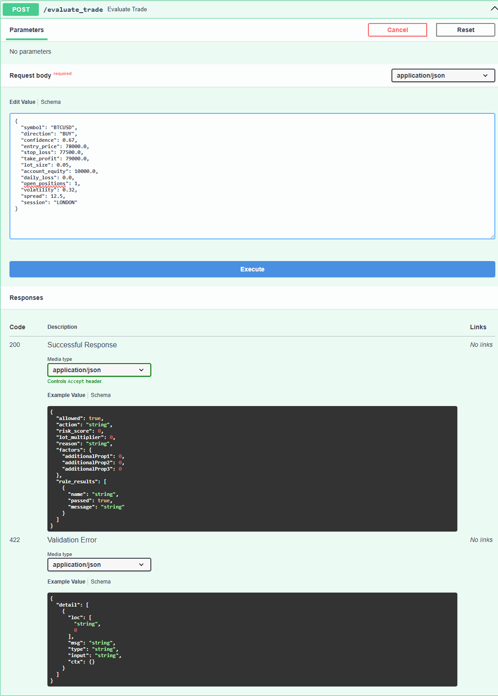

# HyperFlow Risk Agent

[](https://github.com/DCaps123-rgb/hyperflow-risk-agent/actions/workflows/ci.yml)
[](https://www.python.org/)
[](https://fastapi.tiangolo.com/)
[](LICENSE)
[](tests/)

> **HyperFlow Risk Agent is a real-time risk intelligence and control layer for automated trading systems.**

Most trading bots focus on finding entries. HyperFlow focuses on whether a trade should be allowed to execute at all.

HyperFlow does not try to be a magic trading bot. It is the safety brain between trading signals and execution.

## Table of Contents

1. [What Problem Does It Solve?](#what-problem-does-it-solve)
2. [How It Works](#how-it-works)
3. [Architecture](#architecture)
4. [Quick Start — Local](#quick-start--local)
5. [Quick Start — Docker](#quick-start--docker)
6. [API Reference](#api-reference)
7. [Risk Logic Summary](#risk-logic-summary)
8. [Configuration](#configuration)
9. [Test Coverage](#test-coverage)
10. [Live Dashboard](#live-dashboard)
11. [Sample Output](#sample-output)
12. [What Is Not In This Build](#what-is-not-in-this-build)
13. [Design Decisions](#design-decisions)
14. [Roadmap](#roadmap)
15. [Public Safety Note](#public-safety-note)
16. [License](#license)

---

## What Problem Does It Solve?

Automated trading systems are good at generating signals. They are not always good at knowing when to stop.

A strategy that works 60% of the time can still destroy an account if it executes on bad days, during toxic sessions, or when risk thresholds are already breached. Most systems lack a dedicated control layer between signal generation and order execution.

HyperFlow fills that gap.

- Evaluates every trade intent before it is executed
- Applies hard rules that cannot be overridden by the strategy
- Emits a transparent risk score with factor-level explanations
- Returns one of four decisive actions: `ALLOW`, `SCALE_DOWN`, `BLOCK`, `KILL_SWITCH`
- Logs every decision to an auditable JSONL ledger

> ML advises; risk rules govern.

---

## How It Works

A calling system sends a `TradeIntent` payload to `POST /evaluate_trade`. HyperFlow runs a deterministic pipeline:

1. **Feature normalization** — raw trade inputs become bounded feature values
2. **Hard rule evaluation** — 7 mandatory rule checks; any block rule immediately constrains the action
3. **Risk scoring** — a lightweight weighted aggregate across all risk factors
4. **Action resolution** — score thresholds + rule results → `ALLOW / SCALE_DOWN / BLOCK / KILL_SWITCH`
5. **Explainability** — a readable reason string and per-factor breakdown
6. **Decision logging** — appended to `logs/decisions.jsonl` for replay and audit

The entire pipeline is deterministic and stateless per call. The same input always produces the same output.

---

## Architecture

```
┌────────────────────────────────────────────────────┐
│                   Trading Strategy                  │
│          (signal generator / algo engine)           │
└─────────────────────┬──────────────────────────────┘
                      │  POST /evaluate_trade
                      ▼
┌────────────────────────────────────────────────────┐
│               HyperFlow Risk Agent                  │
│                                                      │
│  ┌──────────┐  ┌──────────┐  ┌──────────────────┐  │
│  │ Features │→ │  Rules   │→ │  Scorer          │  │
│  │ Builder  │  │ (7 hard) │  │  (weighted agg.) │  │
│  └──────────┘  └──────────┘  └────────┬─────────┘  │
│                                        │             │
│  ┌─────────────────────────────────────▼──────────┐ │
│  │        Action Resolution                        │ │
│  │  score < 0.45 → ALLOW                           │ │
│  │  score < 0.70 → SCALE_DOWN                      │ │
│  │  score < 0.90 → BLOCK                           │ │
│  │  score ≥ 0.90 → KILL_SWITCH                     │ │
│  └─────────────────────────────────────────────────┘ │
│                          │                            │
│  ┌───────────────────────▼──────────────────────┐   │
│  │  Explainability (reason + factor breakdown)  │   │
│  └───────────────────────────────────────────────┘   │
│                          │                            │
│          logs/decisions.jsonl (JSONL ledger)          │
└──────────────────────────┬─────────────────────────┘
                           │  RiskDecision response
                           ▼
              Execution Layer (conditionally fires)
```

### Module Map

| Path | Purpose |
|---|---|
| `app/main.py` | FastAPI app — endpoints, routing, log write |
| `app/config.py` | Environment-backed settings (`HFRA_` prefix) |
| `app/schemas.py` | Pydantic v2 request/response models |
| `risk_agent/features.py` | Input normalization → feature dict |
| `risk_agent/rules.py` | 7 hard rule checks |
| `risk_agent/scorer.py` | Deterministic risk score `[0.0, 1.0]` |
| `risk_agent/engine.py` | Orchestration pipeline |
| `risk_agent/explainability.py` | Reason strings and factor explanations |
| `risk_agent/replay.py` | Batch evaluation from JSONL |
| `app/dashboard.html` | Dark glassmorphism live risk dashboard |

---

## Quick Start — Local

```bash
# 1. Clone
git clone https://github.com/DCaps123-rgb/hyperflow-risk-agent.git
cd hyperflow-risk-agent

# 2. Create and activate virtual environment
python -m venv .venv

# Linux / macOS:
source .venv/bin/activate

# Windows (PowerShell):
.venv\Scripts\Activate.ps1

# 3. Install dependencies
pip install -r requirements.txt

# 4. Run tests (should be 25 passed)
python -m pytest

# 5. Start API
python -m uvicorn app.main:app --host 127.0.0.1 --port 8000
```

Open:
- Swagger UI: [http://127.0.0.1:8000/docs](http://127.0.0.1:8000/docs)
- Live Dashboard: [http://127.0.0.1:8000/dashboard](http://127.0.0.1:8000/dashboard)
- Dashboard API: [http://127.0.0.1:8000/api/dashboard](http://127.0.0.1:8000/api/dashboard)

---

## Quick Start — Docker

```bash
# Build and run
docker-compose up

# Or build manually
docker build -t hyperflow-risk-agent .
docker run -p 8000:8000 hyperflow-risk-agent
```

---

## API Reference

| Method | Path | Description |
|---|---|---|
| `GET` | `/health` | Service liveness check |
| `GET` | `/version` | Version and build info |
| `POST` | `/evaluate_trade` | Evaluate a trade intent |
| `POST` | `/replay` | Run batch replay over sample data |
| `POST` | `/explain_decision` | Plain-English narrative explanation for a decision |
| `GET` | `/dashboard` | Live risk dashboard (HTML) |
| `GET` | `/api/dashboard` | Dashboard data (JSON) |
| `GET` | `/docs` | Swagger UI |
| `GET` | `/redoc` | ReDoc UI |

### POST /evaluate_trade

**Request body** (`TradeIntent`):

```json
{
  "symbol": "BTCUSD",
  "direction": "BUY",
  "confidence": 0.67,
  "entry_price": 78000.0,
  "stop_loss": 77500.0,
  "take_profit": 79000.0,
  "lot_size": 0.05,
  "account_equity": 10000.0,
  "daily_loss": 0.0,
  "open_positions": 1,
  "volatility": 0.32,
  "spread": 12.5,
  "session": "LONDON"
}
```

**Response** (`RiskDecision`):

```json
{
  "allowed": true,
  "action": "ALLOW",
  "risk_score": 0.3634,
  "lot_multiplier": 1.0,
  "reason": "Trade passed all hard risk checks with acceptable model risk.",
  "factors": {
    "confidence": 0.67,
    "volatility_penalty": 0.096,
    "spread_penalty": 0.025,
    "session_modifier": 0.9
  },
  "rule_results": [
    { "name": "max_daily_loss", "passed": true, "message": "Daily loss is within permitted threshold." }
  ]
}
```

### POST /explain_decision

Accepts the output of `/evaluate_trade` and returns a plain-English narrative breakdown. Entirely deterministic — no external API calls, no modification of the original decision.

**Request body** (same fields as `RiskDecision` output):

```json
{
  "action": "BLOCK",
  "risk_score": 0.75,
  "lot_multiplier": 0.0,
  "factors": { "confidence": 0.40, "volatility_penalty": 0.15 },
  "rule_results": [
    { "name": "minimum_confidence", "passed": false, "message": "Confidence is below minimum threshold." }
  ]
}
```

**Response** (`ExplainResponse`):

```json
{
  "narrative": "This trade was blocked by hard rule 'minimum_confidence' with a risk score of 0.75 (75%). The risk level is classified as HIGH. Hard risk rules protect account equity and cannot be overridden by signal confidence alone.",
  "risk_level": "HIGH",
  "contributing_factors": [
    "Signal Confidence contributed 0.400 to the risk score (lower confidence increases risk).",
    "Market Volatility contributed 0.150 to the risk score (high volatility increases risk)."
  ],
  "failed_rules": ["Minimum Confidence: Confidence is below minimum threshold."],
  "recommendation": "Improve signal quality or wait for a higher-confidence setup.",
  "explainer_version": "1.0.0-template"
}
```

---

## Risk Logic Summary

### Hard Rules (all evaluated every call)

| Rule | Condition | Severity |
|---|---|---|
| `max_daily_loss` | `daily_loss_pct > 5%` | block |
| `max_open_positions` | `open_positions > 3` | block |
| `max_lot_size` | `lot_size > 0.25` | block |
| `minimum_confidence` | `confidence < 0.55` | block |
| `spread_limit` | `spread > 25.0 pips` | block |
| `stop_loss_required` | stop loss missing or invalid | block |
| `session_filter` | off-session or toxic session | scale |

### Action Thresholds

| Action | Score Range | Effect |
|---|---|---|
| `ALLOW` | `< 0.45` | Full execution permitted |
| `SCALE_DOWN` | `0.45 – 0.69` | Lot multiplier reduced |
| `BLOCK` | `0.70 – 0.89` | Trade rejected |
| `KILL_SWITCH` | `≥ 0.90` | Hard stop, all trading suspended |

A block-severity rule failure overrides the score threshold and forces `BLOCK` regardless of score.

---

## Configuration

All settings use the `HFRA_` environment variable prefix.

| Variable | Default | Description |
|---|---|---|
| `HFRA_MAX_DAILY_LOSS_PCT` | `0.05` | Maximum allowed daily loss as a fraction of equity |
| `HFRA_MAX_OPEN_POSITIONS` | `3` | Maximum concurrent open positions |
| `HFRA_MAX_LOT_SIZE` | `0.25` | Maximum lot size per trade |
| `HFRA_MIN_CONFIDENCE` | `0.55` | Minimum signal confidence required |
| `HFRA_MAX_SPREAD` | `25.0` | Maximum spread in pips |
| `HFRA_LOG_PATH` | `logs/decisions.jsonl` | Path for decision audit log |

---

## Test Coverage

```
tests/
├── test_api.py                             # API endpoint integration tests
├── test_engine.py                          # Engine pipeline unit tests
├── test_execution_identity_idempotency.py  # Same input → same output
├── test_execution_invariants.py            # Hard invariant enforcement
├── test_execution_state_consistency.py     # State consistency across calls
├── test_explainability.py                  # Reason + factor output tests
├── test_features.py                        # Feature normalization tests
├── test_gate_correctness.py                # Action boundary correctness
└── test_rules.py                           # Hard rule unit tests
```

Run: `python -m pytest` → **25 passed**

---

## Live Dashboard

HyperFlow includes a single-page dark glassmorphism trading risk command center at `/dashboard`.



Features:
- Live risk posture gauge (semi-circle SVG)
- Risk score sparkline (last 25 evaluations)
- Action distribution pills (`ALLOW / SCALE_DOWN / BLOCK / KILL_SWITCH`)
- Top risk drivers breakdown
- Architecture pipeline visualization
- Cluster analysis of decision patterns
- Live decision feed (last 10)
- Recommendations panel
- Health monitoring cards
- Auto-refresh every 10 seconds

---

## Sample Output

### ALLOW — clean trade

```json
{
  "allowed": true,
  "action": "ALLOW",
  "risk_score": 0.3634,
  "lot_multiplier": 1.0,
  "reason": "Trade passed all hard risk checks with acceptable model risk."
}
```

### BLOCK — confidence too low

```json
{
  "allowed": false,
  "action": "BLOCK",
  "risk_score": 0.6529,
  "lot_multiplier": 0.0,
  "reason": "Trade blocked by hard risk rule: minimum_confidence."
}
```

### KILL_SWITCH — extreme aggregate risk

```json
{
  "allowed": false,
  "action": "KILL_SWITCH",
  "risk_score": 0.9200,
  "lot_multiplier": 0.0,
  "reason": "Trade triggered kill-switch protection due to extreme aggregate risk."
}
```

---

## What Is Not In This Build

The current version is intentionally honest: it does not pretend a predictive ML model is loaded.

| Feature | Status | Notes |
|---|---|---|
| Predictive ML model | Not included | `BaselineRiskModel.is_available()` always `False` |
| Broker / exchange API | Not included | No live order execution |
| Live market data feed | Not included | All inputs come from the caller |
| Account management | Not included | Account state is caller-supplied |
| Real trading logs | Not included | All log data is from demo evaluations |
| Trained model weights | Not included | `models/` directory is reserved for future use |

---

## Design Decisions

**Why deterministic, not ML?**
Hackathon v1 prioritizes auditability and testability. A rule engine with explicit thresholds is easier to reason about, test, and demo than a model that requires training data and inference infrastructure. ML scoring is the next planned evolution.

**Why JSONL logging?**
JSONL is append-only, human-readable, and replay-friendly. Every decision can be fed back into the engine for audit without a database dependency.

**Why four actions instead of a binary approve/reject?**
`SCALE_DOWN` enables graceful degradation. The engine can reduce lot size and continue operating under elevated risk rather than issuing a hard stop every time conditions are suboptimal.

**Why is `KILL_SWITCH` separate from `BLOCK`?**
`BLOCK` rejects a single trade. `KILL_SWITCH` signals that the trading system should halt all operations until conditions normalize. They are semantically distinct control states.

---

## Roadmap

See [docs/ROADMAP.md](docs/ROADMAP.md) for detail. Planned next phases:

- **v1.1** — Outcome logging and label collection pipeline
- **v1.2** — `BaselineRiskModel` trained on historical decisions
- **v1.3** — Adaptive thresholds using model confidence intervals
- **v2.0** — Real-time broker adapter (paper trading mode)

---

## Public Safety Note

This repository is intentionally safe to publish publicly. It does not include:

- Broker credentials or exchange API keys
- Live execution integrations
- Wallet addresses or private keys
- Real account data or real trading logs
- Proprietary HyperFlow strategy logic

All data in this repository is mock or demo-generated.

---

## License

This project is released under the MIT License. See [LICENSE](LICENSE).

---

*Built for the HyperFlow hackathon submission. See [docs/submission.md](docs/submission.md) for judging context.*