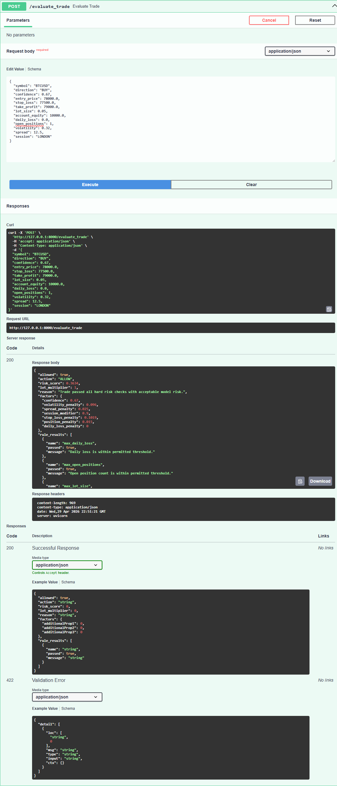

# HyperFlow Risk Agent

[](https://github.com/DCaps123-rgb/hyperflow-risk-agent/actions/workflows/ci.yml)

HyperFlow Risk Agent is a public-safe hackathon demo of an AI-assisted risk intelligence layer that evaluates a proposed trade before execution.

This project demonstrates the risk intelligence layer that autonomous trading systems need before execution.

## What It Does

The service accepts a trade intent, applies deterministic hard risk rules, computes a lightweight risk score, and returns one of four actions:

- `ALLOW`
- `SCALE_DOWN`
- `BLOCK`
- `KILL_SWITCH`

It also returns rule outcomes and factor-level explanations so decisions are easy to inspect during demos and testing.

## Why It Exists

Execution systems need a final control layer before any order leaves the strategy boundary. This repository focuses on that layer only: validating intent quality, rejecting unsafe trades, and providing explainable decisions using mock data.

## Architecture Overview

- `app/`: FastAPI API layer and request/response schemas.
- `risk_agent/`: Risk engine, rules, scoring, feature normalization, explainability, and replay logic.
- `data/`: Sample inputs for demos and offline replay.
- `scripts/`: Local helpers for running the API, generating demo data, replaying scenarios, and training a placeholder baseline model.
- `tests/`: Pytest coverage for the engine, features, explainability, and API.
- `docs/`: Architecture, risk logic, API reference, and roadmap.

For more detail, see [docs/ARCHITECTURE.md](docs/ARCHITECTURE.md).

## API Usage

### Health

```http
GET /health
```

### Version

```http
GET /version
```

### Evaluate Trade

```http
POST /evaluate_trade
Content-Type: application/json
```

Example request:

```json
{
  "symbol": "BTCUSD",
  "direction": "BUY",
  "confidence": 0.67,
  "entry_price": 78000.0,
  "stop_loss": 77500.0,
  "take_profit": 79000.0,
  "lot_size": 0.05,
  "account_equity": 10000.0,
  "daily_loss": 0.0,
  "open_positions": 1,
  "volatility": 0.32,
  "spread": 12.5,
  "session": "LONDON"
}
```

Example response:

```json
{
  "allowed": true,
  "action": "ALLOW",
  "risk_score": 0.37,
  "lot_multiplier": 1.0,
  "reason": "Trade passed all hard risk checks with acceptable model risk.",
  "factors": {
    "confidence": 0.67,
    "volatility_penalty": 0.12,
    "spread_penalty": 0.04,
    "session_modifier": 0.9
  },
  "rule_results": [
    {
      "name": "max_daily_loss",
      "passed": true,
      "message": "Daily loss is within permitted threshold."
    }
  ]
}
```

### Replay

```http
POST /replay
```

Runs the bundled replay dataset and returns aggregate outcomes.

## Quick Start (Docker)

```bash
docker-compose up
```

Then open: `http://127.0.0.1:8000/docs`

## 🚀 Local Setup

```powershell
python -m venv .venv
Set-ExecutionPolicy -Scope Process -ExecutionPolicy Bypass
.venv\Scripts\Activate.ps1
python -m pip install --upgrade pip
python -m pip install -r requirements.txt
python -m pytest
python scripts/run_api.py
```

The API is available at `http://127.0.0.1:8000` and Swagger docs at `http://127.0.0.1:8000/docs`.

## Replay Demo

```bash
python scripts/replay_demo.py
```

## Scoring Model

Current scoring is a deterministic weighted risk model (rule-based). No machine learning model is required to run the system.

Planned extension: adaptive ML-based risk scoring (see [docs/ROADMAP.md](docs/ROADMAP.md)).

## Sample Output

### ALLOW — clean trade passes all checks

```json
{
  "allowed": true,
  "action": "ALLOW",
  "risk_score": 0.3634,
  "lot_multiplier": 1.0,
  "reason": "Trade passed all hard risk checks with acceptable model risk.",
  "factors": {
    "confidence": 0.67,
    "volatility_penalty": 0.096,
    "spread_penalty": 0.025,
    "session_modifier": 0.9,
    "stop_loss_penalty": 0.1019,
    "position_penalty": 0.015,
    "daily_loss_penalty": 0.0
  },
  "rule_results": [
    { "name": "max_daily_loss",      "passed": true,  "message": "Daily loss is within permitted threshold." },
    { "name": "max_open_positions",  "passed": true,  "message": "Open position count is within permitted threshold." },
    { "name": "max_lot_size",        "passed": true,  "message": "Lot size is within configured limit." },
    { "name": "minimum_confidence",  "passed": true,  "message": "Confidence meets minimum threshold." },
    { "name": "spread_limit",        "passed": true,  "message": "Spread is within limit." },
    { "name": "stop_loss_required",  "passed": true,  "message": "Stop loss is present and valid." },
    { "name": "session_filter",      "passed": true,  "message": "Session quality is acceptable." }
  ]
}
```

### BLOCK — trade rejected by hard risk rules

```json
{
  "allowed": false,
  "action": "BLOCK",
  "risk_score": 0.6529,
  "lot_multiplier": 0.0,
  "reason": "Trade blocked by hard risk rule: minimum_confidence.",
  "factors": {
    "confidence": 0.4,
    "volatility_penalty": 0.15,
    "spread_penalty": 0.056,
    "session_modifier": 1.2,
    "stop_loss_penalty": 0.15,
    "position_penalty": 0.015,
    "daily_loss_penalty": 0.0019
  },
  "rule_results": [
    { "name": "max_daily_loss",      "passed": true,  "message": "Daily loss is within permitted threshold." },
    { "name": "max_open_positions",  "passed": true,  "message": "Open position count is within permitted threshold." },
    { "name": "max_lot_size",        "passed": true,  "message": "Lot size is within configured limit." },
    { "name": "minimum_confidence",  "passed": false, "message": "Confidence is below minimum threshold." },
    { "name": "spread_limit",        "passed": false, "message": "Spread exceeds configured limit." },
    { "name": "stop_loss_required",  "passed": false, "message": "Stop loss is missing or invalid." },
    { "name": "session_filter",      "passed": false, "message": "Session is weak and should be treated cautiously." }
  ]
}
```

## Demo




## Public Safety Note

This repository is intentionally safe to publish publicly. It does not include broker credentials, exchange integrations, wallet keys, live execution code, real account data, real trading logs, or proprietary HyperFlow trading logic.

All data in this repository is mock or sample data only.

## License

This project is released under the MIT License. See [LICENSE](LICENSE).